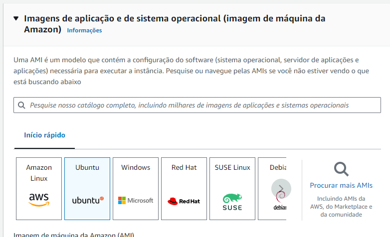

# LaravelAWSDeploy
Como subir seu projeto Laravel para AWS EC2 - Guia: Passo-a-passo

- Sobre esse curso -

Muitas ofertas de emprego mencionam experiência prévia em AWS (Amazon Web Services) como requisito para vaga.
O sistema AWS é gigante, com inúmeras funcionalidades, mas o foco desse curso é configurar um servidor e colocar seu projeto Laravel em produção.

A plataforma mais simples para isso é chamada de EC2 (Amazon Elastic Compute Cloud), e mostrarei em detalhes passo-a-passo para você:

- Como criar um servidor
- Como instalar/configurar as ferramentas para PHP/Laravel
- Finalmente, como fazer o "deploy" do seu projeto Laravel.

Esse vai ser um curso baseado em texto, pelo menos por enquanto, com uma grande quantidade de capturas de tela e comandos de terminais, para cada passo.

Você também vai aprender os principais comandos dos terminais em Linux, configurar domínios (DNS), dependências PHP e mais.

Nesse sentido, esse curso também pode ser chamado de "Configurando um servidor Ubuntu para Laravel", utilizando o exemplo do AWS EC2.

# Requisitos de Servidor Laravel

De acordo com a <b href="https://laravel.com/docs/10.x/deployment#main-content">Documentação Oficial</b>, os requisitos de servidor são:

- PHP >= 8.1
- Ctype PHP Extension
- cURL PHP Extension
- DOM PHP Extension
- Fileinfo PHP Extension
- Filter PHP Extension
- Hash PHP Extension
- Mbstring PHP Extension
- OpenSSL PHP Extension
- PCRE PHP Extension
- PDO PHP Extension
- Session PHP Extension
- Tokenizer PHP Extension
- XML PHP Extension

# Requisitos do nosso projeto

Essas dependências podem variar dependendo do que seu projeto, mas por enquanto, vamos atentar a lista abaixo para poupar tempo:

- NginX HTTP Server
- PHP-FPM
- Zip PHP Extension
- GD PHP Extension
- PHP CLI
- Composer
- MySQL PHP Extension
- Amazon RDS as MySQL server

# Configurar ambiente EC2

1. Primeiro você precisa ter uma conta AWS, registre ou entre em: https://aws.amazon.com/. Quando você logar vai ver parecido com isso:

Click on the EC2 link in the top bar.
Alternatively, you can find it in the Services menu under Compute category:
Clique no link EC2. Alternativamente, você pode encontrar no menu de "Serviços", na categoria "Computação".

Agora você pode visualizar o seu painel de controle do EC2. 

 
No canto superior direito, você precisa escolher sua região primeiro. Todas as estatísticas do painel de controle são mostradas para a região selecionada, incluindo suas instâncias de servidores. Escolha uma que se encaixa melhor no seu caso, levando em consideração a distância.

 
Na segunda sessão do painel de controle, existe uma janela com o nome "Executar Instância". O seu servidor é chamado de "instância" no EC2. Clique para executar para prosseguir.

Escolha um nome para seu servidor para prosseguir

 
The image was left unchanged, other images are for more specific scenarios.
Escolha uma imagem do Sistema Operacional. Nós vamos selecionar Ubunto porque possui muitas ferramentas e não precisa de nenhuma instalação de dependência.

Para a nossa proposta não vamos mexer no tipo de instância. Dependendo do tamanho do seu projeto você pode precisar atualizar, mas aqui vamos com o padrão que é gratuito.

 
Para acessar a instância criada posteriormente, você vai precisar da chave SSH do servidor. Crie uma nova através do botão: 

Entre uma única chave par e selecione as opções

Tipo de par de chaves: RSA
Formato de arquivo de chave privada: .pem

 
Selecionar no canto inferior direito o botão para criar o par de chaves e fazer o download da chave.

A sua nova chave foi baixada!

 
 
Abaixo, nas configurações de rede, escolhe "Meu IP" para permitir acesso somente para o seu endereço IP. Também habilite "Permitir HTTPS tráfego da internet e Permitir HTTP tráfico da intertet".

 
Agora você pode configurar seu armazenamento para adiconar volumes maiores para seus dados. Deixaremos os valores padrões nesse curso.

 
Nenhuma mudança é necessária na sessão de detalhes avançados. Confira o resumo no canto direito e pressione o botão para Inicializar a Instância.

Depois disso você vai ver essa imagem:

Quando o processo for concluído aparecerá isso:
